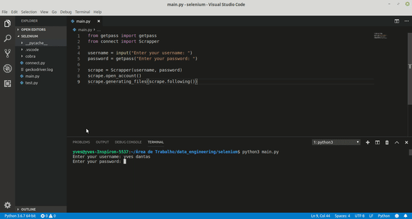

# Instagram-Scrapebot
Scrapping instagram data with Selenium WebDriver
## Usage
The bot opens an instagram account, get all the following usernames, open the view-sorce page for each account, extract the content at the tag containing the JSON file wich would be injected into the user's perfil page, then saves the files in a folder called json_files. To excecute the code, install the selenium webdriver, save both <code>main.py</code> and <code>connect.py</code> in the same folder, then run:
```
$ python3 main.py
```
Take a look at this gif to see how it works :))
<div style="text-align:center"></div>